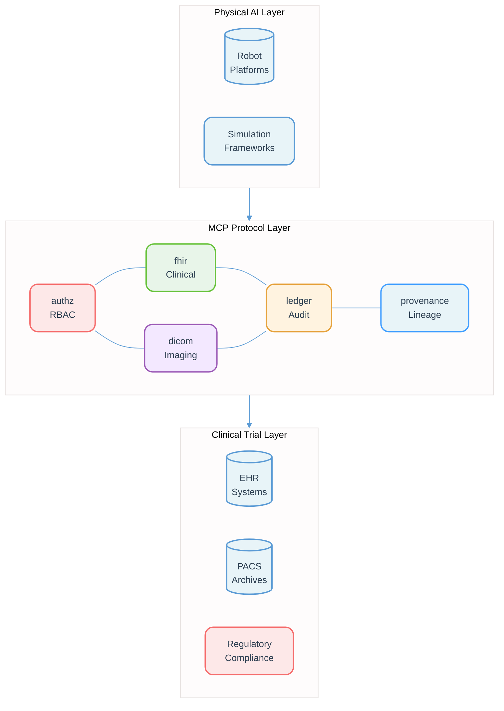
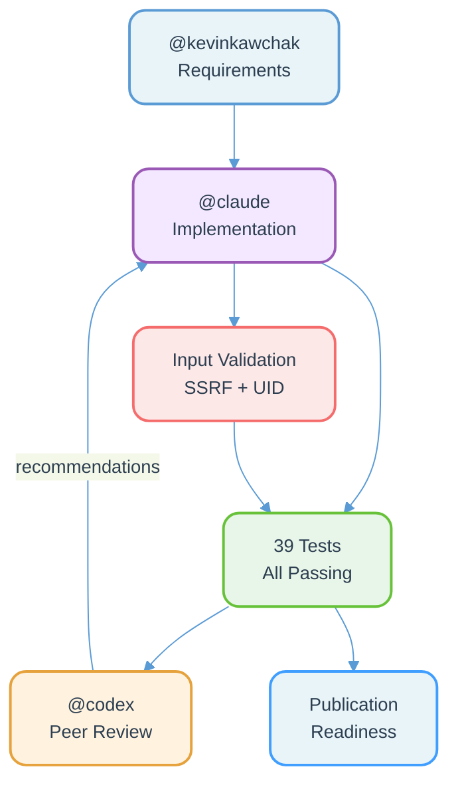

# MCP Servers for Physical AI Oncology Clinical Trial Systems


[](https://doi.org/10.5281/zenodo.18869776)
[](#team-and-collaboration)

**TrialMCP** -- A suite of open Model Context Protocol (MCP) servers and reference clients enabling autonomous oncology trial robots and AI agents to interface with clinical systems: scheduling, eConsent, EDC/eSource repositories, imaging archives, and laboratory systems.

Point-to-point integrations between robotic platforms and clinical infrastructure do not scale. MCP is an emerging open protocol (Linux Foundation AAIF) for connecting AI tools to external data sources. This project provides the interoperability layer that bridges Physical AI robotics with regulated clinical trial operations across federated multi-site deployments.

---

Three research papers presenting TrialMCP from complementary perspectives, published under DOI [10.5281/zenodo.18870961](https://doi.org/10.5281/zenodo.18870961).

---

## Table of Contents

- [Architecture Overview](#architecture-overview)
- [MCP Servers](#mcp-servers)
- [Reference Client](#reference-client)
- [USL Integration](#usl-integration)
- [Federated Learning Integration](#federated-learning-integration)
- [Security and Compliance](#security-and-compliance)
- [Datasets](#datasets)
- [Milestones](#milestones)
- [Getting Started](#getting-started)
- [Testing](#testing)
- [Team and Collaboration](#team-and-collaboration)

---

## Architecture Overview

The TrialMCP connects autonomous trial robots to clinical systems through a layered MCP architecture with authorization enforcement, privacy-preserving data access, and comprehensive audit logging.

```
 TRIALMCP -- END-TO-END ARCHITECTURE
 ==========================================

 +---------------------------+     +---------------------------+
 |    ROBOT AGENTS           |     |    HUMAN AGENTS           |
 |  (Physical AI Platforms)  |     |  (Trial Staff / Monitors) |
 |                           |     |                           |
 |  Franka Panda (USL 7.4)   |     |  Trial Coordinators       |
 |  da Vinci dVRK (USL 7.1)  |     |  Data Monitors            |
 |  Kinova Gen3  (USL 5.7)   |     |  Auditors                 |
 +-------------|-------------+     +-------------|-------------+
               |                                 |
               v                                 v
 +-----------------------------------------------------------+
 |              TRIALMCP-AUTHZ  (Policy Decision Point)      |
 |                                                           |
 |   RBAC Policy Engine        Token Management              |
 |   Deny-by-Default           Session Scoping               |
 |   Role: robot_agent         Role: trial_coordinator       |
 |   Role: data_monitor        Role: auditor                 |
 +-------------------------------|---------------------------+
                                 |
          +----------------------+----------------------+
          |                      |                      |
          v                      v                      v
 +----------------+   +------------------+   +-------------------+
 | TRIALMCP-FHIR  |   | TRIALMCP-DICOM   |   | TRIALMCP-LEDGER   |
 | (Read-Only)    |   | (Query/Retrieve) |   | (Audit Chain)     |
 |                |   |                  |   |                   |
 | Patient Lookup |   | C-FIND Proxy     |   | Hash-Chain Append |
 | Study Status   |   | C-MOVE Pointers  |   | Chain Verify      |
 | FHIR Search    |   | RECIST 1.1       |   | Replay Traces     |
 | De-ID Pipeline |   | Permission Gates |   | 21 CFR Part 11    |
 +----------|-----+   +---------|--------+   +---------|---------+
            |                   |                      |
            +-------------------+----------------------+
                                |
                                v
 +-----------------------------------------------------------+
 |           TRIALMCP-PROVENANCE  (Data Gateway)             |
 |                                                           |
 |   Source Registration      Access Recording               |
 |   Lineage Tracking         Integrity Verification         |
 |   Actor History            SHA-256 Fingerprinting         |
 |   Least-Privilege          Replayable Audit Traces        |
 +-----------------------------------------------------------+
```

**Figure 1.** TrialMCP end-to-end architecture showing robot and human agents accessing clinical data through the authorization layer, specialized MCP servers, and the data provenance gateway.

### Peer-Review Driven Development

```mermaid
%%{init: {'theme': 'base', 'themeVariables': {'primaryColor': '#e8f4f8', 'primaryBorderColor': '#5b9bd5', 'primaryTextColor': '#2c3e50', 'lineColor': '#5b9bd5', 'secondaryColor': '#fff3e0', 'tertiaryColor': '#e8f5e9', 'fontSize': '14px'}}}%%
flowchart LR
    subgraph BUILD ["v0.1.0 Build"]
        direction TB
        A["Server Code"]:::card
        B["Test Suite"]:::card
        C["Datasets"]:::card
    end
    subgraph REVIEW ["v0.1.1 Review"]
        direction TB
        D["@codex Audit"]:::reviewcard
        E["Recommendations"]:::reviewcard
        F["Gap Analysis"]:::reviewcard
    end
    subgraph HARDEN ["v0.2.0 Harden"]
        direction TB
        G["Validation"]:::greencard
        H["Error Codes"]:::greencard
        I["Token Expiry"]:::greencard
    end

    BUILD --> REVIEW --> HARDEN

    classDef card fill:#e8f4f8,stroke:#5b9bd5,stroke-width:2px,rx:12,ry:12,color:#2c3e50
    classDef reviewcard fill:#fff3e0,stroke:#e6a23c,stroke-width:2px,rx:12,ry:12,color:#2c3e50
    classDef greencard fill:#e8f5e9,stroke:#67c23a,stroke-width:2px,rx:12,ry:12,color:#2c3e50
```



**Figure 7.** Peer-review driven development lifecycle from initial build through @codex audit to hardened release.

---

## MCP Servers

### trialmcp-fhir (Read-Only Clinical Data)

Provides scoped, read-only access to FHIR R4 resources relevant to oncology clinical trials. All patient data passes through HIPAA Safe Harbor de-identification (18 identifier categories) before return.

**Tools:**
| Tool | Description |
|------|-------------|
| `fhir_read` | Read a single FHIR resource by type and ID (de-identified) |
| `fhir_search` | Search resources by type with optional filters |
| `fhir_patient_lookup` | Privacy-aware patient lookup with pseudonymization |
| `fhir_study_status` | Get ResearchStudy status, phase, and enrollment count |

**Supported FHIR Resources:** Patient, ResearchStudy, ResearchSubject, Condition, MedicationAdministration, Observation, AdverseEvent, DiagnosticReport, ImagingStudy

**De-identification Pipeline:**
- HMAC-SHA256 pseudonymization with site-specific salts
- Name, address, telecom, and identifier removal
- Birth date generalization to year only (Safe Harbor)
- Subject reference pseudonymization in clinical resources

### trialmcp-dicom (Imaging Query/Retrieve)

DICOM query/retrieve proxy with strict role-based permission enforcement. Supports C-FIND queries and C-MOVE retrieval pointers with time-limited secure tokens.

**Tools:**
| Tool | Description |
|------|-------------|
| `dicom_query` | Query imaging studies (C-FIND proxy) at PATIENT/STUDY/SERIES levels |
| `dicom_retrieve_pointer` | Get time-limited retrieval token for a study (C-MOVE proxy) |
| `dicom_study_metadata` | Get detailed study metadata with series breakdown |
| `dicom_recist_measurements` | Retrieve RECIST 1.1 tumor measurements from a study |

**Permission Matrix:**
| Role | Query Levels | Modalities | Can Retrieve |
|------|-------------|------------|--------------|
| trial_coordinator | PATIENT, STUDY, SERIES | CT, MR, PT, DX, CR | Yes |
| robot_agent | STUDY, SERIES | CT, MR, RTSTRUCT, RTPLAN | Yes |
| data_monitor | PATIENT, STUDY | CT, MR, PT | No |
| auditor | STUDY | None | No |

### trialmcp-ledger (Audit Chain-of-Custody)

Append-only, hash-chained audit ledger satisfying 21 CFR Part 11 requirements for electronic records in clinical trials. Every MCP tool invocation across all servers produces a signed audit record linked via SHA-256 hash chain.

**Tools:**
| Tool | Description |
|------|-------------|
| `ledger_append` | Append an audit record to the hash-chained ledger |
| `ledger_verify` | Verify integrity of the full audit chain |
| `ledger_query` | Query audit records with server/tool/caller/time filters |
| `ledger_replay` | Generate a replayable audit trace for compliance review |
| `ledger_chain_status` | Get current chain status, length, and latest hash |

```
 AUDIT HASH CHAIN -- 21 CFR PART 11 COMPLIANCE
 ===============================================

 +------------------+     +------------------+     +------------------+
 |  GENESIS BLOCK   |     |  AUDIT RECORD 1  |     |  AUDIT RECORD 2  |
 |                  |     |                  |     |                  |
 |  prev: 000...0   |---->|  prev: hash(G)   |---->|  prev: hash(R1)  |
 |  server: system  |     |  server: fhir    |     |  server: dicom   |
 |  tool: init      |     |  tool: fhir_read |     |  tool: dicom_qry |
 |  caller: system  |     |  caller: robot-1 |     |  caller: robot-1 |
 |  hash: SHA-256   |     |  hash: SHA-256   |     |  hash: SHA-256   |
 +------------------+     +------------------+     +------------------+
         |                                                    |
         |   CHAIN VERIFICATION: Recompute each hash and      |
         |   verify prev_hash links match. Any tampering,     |
         |   deletion, or reordering breaks the chain.        |
         +----------------------------------------------------+

 Properties:
   - Append-only: Records cannot be modified or deleted
   - Hash-linked: Each record includes hash of previous record
   - Tamper-evident: Any modification breaks the chain
   - Replayable: Full trace can be replayed for incident review
   - ICH-GCP E6(R2): Satisfies electronic records guidance
```

**Figure 2.** Audit hash chain structure showing the SHA-256 linked records that provide tamper-evident logging for 21 CFR Part 11 compliance.

### trialmcp-authz (Authorization Policies)

Policy decision point (PDP) for the entire TrialMCP implementing role-based access control with deny-by-default semantics.

**Tools:**
| Tool | Description |
|------|-------------|
| `authz_evaluate` | Evaluate authorization request (role + server + tool) |
| `authz_issue_token` | Issue a session token for an agent |
| `authz_validate_token` | Validate an existing session token |
| `authz_list_policies` | List all active authorization policy rules |
| `authz_revoke_token` | Revoke an active session token |

**Default Policy Rules:**
- Trial coordinators: Full read access to FHIR and DICOM
- Robot agents: Scoped access (read + study status for FHIR; query + retrieve for DICOM)
- Data monitors: Read-only, no DICOM retrieval
- Auditors: Ledger access only
- All roles: Chain status and verification access
- Explicit DENY overrides ALLOW

### trialmcp-provenance (Data Gateway)

Data provenance gateway enforcing least-privilege access, logging all tool calls, and providing replayable audit traces. Tracks lineage of every piece of clinical data accessed through MCP tools.

**Tools:**
| Tool | Description |
|------|-------------|
| `provenance_register_source` | Register a data source (FHIR, DICOM, scheduling, eSource, eConsent) |
| `provenance_record_access` | Record data access/transformation events |
| `provenance_get_lineage` | Get full access lineage for a data source |
| `provenance_get_actor_history` | Get all access history for a specific actor |
| `provenance_verify_integrity` | Verify data integrity via SHA-256 fingerprint |

---

## Reference Client

### Trial Robot Agent

The reference client demonstrates how autonomous oncology trial robots interface with all TrialMCP servers in a complete workflow:

```
 TRIAL ROBOT AGENT -- WORKFLOW SEQUENCE
 ========================================

 Robot Agent                  TrialMCP Servers
 (Franka Panda)
      |
      |  1. AUTHENTICATE
      |--------------------->  trialmcp-authz
      |  Issue session token     |
      |<---------------------    | token_id + role
      |
      |  2. FETCH TASK ORDER
      |--------------------->  trialmcp-fhir
      |  Study status query      |
      |<---------------------    | study phase + enrollment
      |
      |  3. RETRIEVE IMAGING
      |--------------------->  trialmcp-dicom
      |  Get study pointer       |
      |<---------------------    | retrieval_token + endpoint
      |
      |  4. EXECUTE PROCEDURE
      |  (Robot performs task)
      |
      |  5. UPLOAD EVIDENCE
      |--------------------->  trialmcp-ledger
      |  Append audit record     |
      |<---------------------    | audit_id + record_hash
      |
      |  6. RECORD PROVENANCE
      |--------------------->  trialmcp-provenance
      |  Track data access       |
      |<---------------------    | record_id + confirmation
      |
      |  ALL STEPS AUDITED IN HASH CHAIN
      +
```

**Figure 3.** Trial robot agent workflow showing the six-step sequence from authentication through provenance recording, with every operation producing an audit record in the hash-chained ledger.

**Supported Robot Platforms (from USL evaluation):**
| Platform | Type | USL Score | Band |
|----------|------|-----------|------|
| Franka Emika Panda | Cobot | 7.4 | Advanced |
| da Vinci dVRK | Surgical | 7.1 | Advanced |
| Kinova Gen3 | Cobot | 5.7 | Intermediate |
| Atlas Electric | Humanoid | 5.8 | Intermediate |
| Hugo RAS | Surgical | 4.5 | Foundational |
| Agility Digit | Humanoid | 4.2 | Foundational |
| Tesla Optimus | Humanoid | 3.6 | Foundational |

---

## USL Integration

The Unification Standard Level (USL) is a quantitative scoring framework (1.0-10.0) evaluating robotic platform readiness for multi-site oncology trials across four equally-weighted dimensions:

| Dimension | Focus | MCP Relevance |
|-----------|-------|---------------|
| **A** - Simulation Framework Switching | Policy transfer across Isaac Lab, MuJoCo, Gazebo, PyBullet | Simulation task orders via FHIR |
| **B** - Generative/Agentic AI Integration | LLM, VLA, diffusion policy, MCP integration depth | MCP is a direct scoring criterion |
| **C** - Cross-Robot Progress Sharing | ONNX export, ROS 2 interfaces, federated learning | Cross-site data sharing via provenance gateway |
| **D** - Multi-Site Clinical Trial Collaboration | FDA/CE clearance, HIPAA, 21 CFR Part 11, audit trails | Full trialmcp-ledger + trialmcp-authz |

**USL Score Bands:** Exemplary (9.0-10.0), Advanced (7.0-8.9), Intermediate (5.0-6.9), Foundational (3.0-4.9), Initial (1.0-2.9)

MCP integration is explicitly part of USL Dimension B scoring criteria. The TrialMCP provides the standardized AI agent interface for unified task planning across robot platforms, directly improving Dimension B and D scores.

---

## Federated Learning Integration

The TrialMCP integrates with the five-pillar federated learning architecture for multi-site oncology trials:

| Pillar | Focus | TrialMCP Integration |
|--------|-------|---------------------|
| **1** - Privacy Infrastructure | HIPAA Safe Harbor, de-identification, RBAC | fhir de-identification pipeline, authz RBAC |
| **2** - Regulatory Infrastructure | FDA, IRB, ICH-GCP compliance | ledger 21 CFR Part 11 audit chain |
| **3** - Cross-Framework Unification | Isaac-MuJoCo bridge, agent interfaces | MCP tool interface for cross-platform agents |
| **4** - Standards & Benchmarking | Model registry, cross-platform benchmarks | USL scoring exposed as MCP resources |
| **5** - Multi-Organization Cooperation | Federated training, differential privacy | Provenance gateway with per-site policies |

**Federated Aggregation Support:** FedAvg, FedProx (proximal regularization for non-IID hospital data), SCAFFOLD (control variate correction for client drift)

**Data Harmonization:** DICOM, FHIR, LOINC, RxNorm, MedDRA vocabulary mapping across trial sites

**Six Agentic AI Patterns** from the FL reference architecture inform the MCP server design:
1. **MCP Oncology Server** (Script 01): Five core tools -- `patient_lookup`, `treatment_simulation`, `protocol_compliance`, `robotic_telemetry`, `adverse_event_reporting`
2. **ReAct Treatment Planner** (Script 02): Thought-action-observation loops for clinical decisions
3. **Real-Time Adaptive Monitoring** (Script 03): Streaming multi-modal data with CTCAE v5.0 grading
4. **Autonomous Simulation Orchestrator** (Script 04): Multi-framework job coordination with Pareto optimization
5. **Safety-Constrained Executor** (Script 05): IEC 80601-2-77 safety gates, human-in-the-loop approval
6. **Oncology RAG Compliance** (Script 06): Semantic chunking of regulatory documents with citation tracking

```
 FEDERATED MCP DEPLOYMENT -- MULTI-SITE TRIAL TOPOLOGY
 =======================================================

       SITE A                    SITE B                    SITE C
 +------------------+     +------------------+     +------------------+
 | trialmcp-fhir    |     | trialmcp-fhir    |     | trialmcp-fhir    |
 | trialmcp-dicom   |     | trialmcp-dicom   |     | trialmcp-dicom   |
 | trialmcp-authz   |     | trialmcp-authz   |     | trialmcp-authz   |
 | trialmcp-ledger  |     | trialmcp-ledger  |     | trialmcp-ledger  |
 +--------|---------+     +--------|---------+     +--------|---------+
          |                        |                        |
          |     Differential       |     Secure             |
          |     Privacy            |     Aggregation        |
          v                        v                        v
 +--------------------------------------------------------------------+
 |          FEDERATED COORDINATION LAYER                              |
 |                                                                    |
 |   FedAvg / FedProx / SCAFFOLD Aggregation                          |
 |   Cross-Site Audit Log Synchronization                             |
 |   DICOM/FHIR/LOINC/RxNorm/MedDRA Harmonization                     |
 |   Per-Site Privacy Budget Enforcement                              |
 +---------------------------------|----------------------------------+
                                   |
                                   v
 +--------------------------------------------------------------------+
 |           TRIALMCP-PROVENANCE  (Central Gateway)                   |
 |                                                                    |
 |   Cross-Site Lineage Tracking                                      |
 |   Data Fingerprint Verification                                    |
 |   Actor History Across Sites                                       |
 |   Replayable Multi-Site Audit Traces                               |
 +--------------------------------------------------------------------+
```

**Figure 4.** Federated MCP deployment topology showing per-site TrialMCP server instances coordinated through a federated layer with differential privacy and cross-site audit synchronization.

### MCP PAI Oncology Trial Lifecycle



**Figure 9.** MCP PAI oncology trial lifecycle showing the three-layer architecture: Physical AI platforms, MCP protocol servers, and clinical trial systems connected through standardized interfaces.

---

## Security and Compliance

### Validation Test Suite (39 tests, all passing)

**Security Tests (18 tests):**
- SSRF prevention: URL-based resource IDs and study UIDs rejected with `VALIDATION_FAILED` error codes
- Encoded URL variant rejection (HTTPS in resource IDs, DICOM UIDs)
- Injection prevention: JSON injection and SQL injection in parameters
- Permission escalation: Role boundary enforcement across all servers
- Replay prevention: Token revocation and hash-chain integrity
- Token expiry enforcement: Zero-TTL tokens rejected immediately
- Health endpoint availability across all servers
- Policy decision trace validation (allow and deny paths)

**Audit Completeness Tests (12 tests):**
- Every FHIR tool call produces a signed audit record
- Every DICOM tool call produces an audit record (including denials)
- Ledger hash-chain integrity after multi-record appends
- Provenance tool calls produce audit records

**Integration Tests (9 tests):**
- End-to-end robot agent workflow across all 5 MCP servers
- De-identification verification in FHIR responses
- Permission enforcement during workflow execution
- Audit chain integrity after complete workflows
- Cross-server trace verification (authz -> fhir -> dicom -> ledger linkage)

### Regulatory Compliance

| Standard | Implementation |
|----------|---------------|
| **21 CFR Part 11** | Hash-chained audit ledger with tamper detection |
| **HIPAA Safe Harbor** | 18-identifier de-identification pipeline |
| **ICH-GCP E6(R2)** | Replayable audit traces for all electronic records |
| **IEC 80601** | Safety-constrained execution patterns |
| **ISO 14971** | Risk management through permission policies |
| **ISO 13482** | Robot safety standards integration |
| **FDA 510(k)/De Novo/PMA** | Regulatory pathway awareness in study metadata |

### Security Hardening

- **Authentication:** Token-based session management with role scoping and expiry enforcement
- **Authorization:** Deny-by-default RBAC with explicit DENY precedence and policy decision traces
- **Input validation:** FHIR ID and DICOM UID format validation, SSRF prevention
- **Error taxonomy:** Machine-readable error codes (`AUTHZ_DENIED`, `VALIDATION_FAILED`, `NOT_FOUND`)
- **Privacy:** HMAC-SHA256 pseudonymization, Safe Harbor de-identification
- **Integrity:** SHA-256 hash chains with canonical serialization, data fingerprinting
- **Audit:** Every tool call logged, replayable traces, chain verification
- **Health monitoring:** Health/readiness endpoints on all servers
- **Least Privilege:** Role-scoped access to servers, tools, and data

```
 DATA FLOW SECURITY -- PRIVACY-PRESERVING ACCESS PATTERN
 =========================================================

 Agent Request              Security Layers                    Data Store
      |                          |                                |
      |  1. Token Presented      |                                |
      |------------------------->|                                |
      |                    [authz_evaluate]                       |
      |                    Role + Server + Tool                   |
      |                          |                                |
      |                    2. DENY by default                     |
      |                    Check ALLOW rules                      |
      |                    Check DENY overrides                   |
      |                          |                                |
      |                    3. Permission Granted                  |
      |                          |------------------------------->|
      |                          |     Raw clinical data          |
      |                          |<-------------------------------|
      |                          |                                |
      |                    4. De-identification                   |
      |                    HIPAA Safe Harbor (18 IDs)             |
      |                    HMAC-SHA256 pseudonymize               |
      |                          |                                |
      |                    5. Audit Record                        |
      |                    SHA-256 hash chain                     |
      |                    21 CFR Part 11                         |
      |                          |                                |
      |  6. De-identified data   |                                |
      |<-------------------------|                                |
      |                          |                                |
```

**Figure 5.** Data flow security showing the privacy-preserving access pattern through authorization, de-identification, and audit logging layers.

### Quality Assurance Cycle



**Figure 8.** Quality assurance cycle showing the collaborative workflow between @kevinkawchak (requirements), @claude (implementation), and @codex (peer review) converging on publication readiness.

---

## Datasets

### Synthetic FHIR Bundles (`datasets/fhir-bundles/`)
- 2 ResearchStudy resources (Phase II robotic biopsy, Phase III adaptive immunotherapy)
- 3 Patient resources (de-identified synthetic)
- 3 ResearchSubject enrollment records
- 2 Condition resources (NSCLC, colorectal cancer)
- 2 Observation resources (tumor size, biomarkers)
- 1 MedicationAdministration (Pembrolizumab)
- 1 AdverseEvent (Grade 2 fatigue, CTCAE v5.0)

### Synthetic DICOM Index (`datasets/dicom-samples/`)
- 3 imaging studies: CT Chest, MR Abdomen, PET/CT Whole Body
- RECIST 1.1 measurements with target lesion tracking
- Multi-series studies with modality breakdown

### Simulated Scheduling Data (`datasets/scheduling/`)
- 3 scheduled robotic procedures across 2 trial sites
- USL-scored platform assignments (Franka Panda 7.4, Kinova Gen3 5.7, dVRK 7.1)
- Prerequisite tracking (imaging, consent, lab results)

---

## Milestones

| Milestone | Timeline | Deliverables | Status |
|-----------|----------|-------------|--------|
| **M1** | 0-4 months | Read-only clinical data MCP servers + auth framework | In Progress |
| **M2** | 4-8 months | DICOM/FHIR provenance gateway + replay logs | Planned |
| **M3** | 8-12 months | Reference trial robot agent integration demo | Planned |

### M1 Deliverables (Current)
- `trialmcp-fhir`: Read-only FHIR access with de-identification
- `trialmcp-dicom`: DICOM query/retrieve proxy with permissions
- `trialmcp-authz`: RBAC policy engine with token management
- `trialmcp-ledger`: Hash-chained audit ledger
- `trialmcp-provenance`: Data provenance gateway
- Security test suite (SSRF, injection, escalation, replay)
- Audit completeness tests
- Synthetic datasets (FHIR, DICOM, scheduling)

### M2 Deliverables (Planned)
- Production FHIR server proxy (HAPI FHIR integration)
- Production DICOM proxy (Orthanc/dcm4chee integration)
- Persistent audit storage with signed timestamps
- Cross-site replay log synchronization

### M3 Deliverables (Planned)
- Reference robot agent with ROS 2 integration
- Live demo with USL-scored platforms
- eConsent workflow integration
- eSource upload with certified evidence chain

---

## Getting Started

### Prerequisites

- Python 3.11+
- pip

### Installation

```bash
git clone https://github.com/kevinkawchak/mcp-pai-oncology-trials.git
cd mcp-pai-oncology-trials
pip install pytest jsonschema
```

### Quick Start

```python
import json
from servers.trialmcp_fhir.src.fhir_server import FHIRMCPServer
from servers.trialmcp_dicom.src.dicom_server import DICOMMCPServer
from servers.trialmcp_ledger.src.ledger_server import LedgerMCPServer
from servers.trialmcp_authz.src.authz_server import AuthzMCPServer
from servers.trialmcp_provenance.src.provenance_server import ProvenanceMCPServer
from clients.reference_agent.src.trial_robot_agent import TrialRobotAgent

# Initialize servers
ledger = LedgerMCPServer()
fhir = FHIRMCPServer(audit_callback=lambda r: ledger.handle_tool_call(
    "ledger_append", {"server": r["server"], "tool": r["tool"],
     "caller_id": "system", "result_summary": r["result_summary"]}
))
dicom = DICOMMCPServer()
authz = AuthzMCPServer()
provenance = ProvenanceMCPServer()

# Load synthetic data
with open("datasets/fhir-bundles/oncology_trial_bundle.json") as f:
    fhir.store.load_bundle(json.load(f))
with open("datasets/dicom-samples/study_index.json") as f:
    for study in json.load(f)["studies"]:
        dicom.index.index_study(study)

# Run a robot agent workflow
agent = TrialRobotAgent(platform="Franka Panda")
result = agent.execute_sample_workflow(
    authz_server=authz,
    fhir_server=fhir,
    dicom_server=dicom,
    ledger_server=ledger,
    provenance_server=provenance,
    study_id="ONCO-TRIAL-2026-001",
    dicom_study_uid="1.2.826.0.1.3680043.8.1055.1.20260301.1",
)
print(f"Workflow completed: {result['workflow_id']}")

# Verify audit chain integrity
chain = ledger.handle_tool_call("ledger_verify", {})
print(f"Audit chain valid: {chain['valid']}, length: {chain['chain_length']}")
```

---

## Testing

```bash
# Run all tests
python -m pytest tests/ -v

# Run security tests only
python -m pytest tests/security/ -v

# Run audit completeness tests
python -m pytest tests/audit/ -v

# Run integration tests
python -m pytest tests/integration/ -v
```

**Test Coverage:** 39 tests across 3 categories (security, audit, integration)

---

## Repository Structure

```
mcp-pai-oncology-trials/
├── servers/
│   ├── common/                 # Shared error codes, validation, health checks
│   │   └── __init__.py
│   ├── trialmcp_fhir/          # Read-only FHIR MCP server
│   │   └── src/
│   │       └── fhir_server.py
│   ├── trialmcp_dicom/         # DICOM query/retrieve MCP server
│   │   └── src/
│   │       └── dicom_server.py
│   ├── trialmcp_ledger/        # Audit ledger MCP server
│   │   └── src/
│   │       └── ledger_server.py
│   ├── trialmcp_authz/         # Authorization policy MCP server
│   │   └── src/
│   │       └── authz_server.py
│   └── trialmcp_provenance/    # Data provenance gateway
│       └── src/
│           └── provenance_server.py
├── clients/
│   └── reference_agent/        # Trial robot agent reference client
│       └── src/
│           └── trial_robot_agent.py
├── datasets/
│   ├── fhir-bundles/           # Synthetic FHIR R4 bundles
│   ├── dicom-samples/          # Synthetic DICOM study index
│   ├── scheduling/             # Simulated trial scheduling data
│   ├── manifest.json           # SHA-256 checksums for reproducibility
│   └── README.md               # Data dictionary and provenance
├── tests/
│   ├── security/               # SSRF, injection, escalation, replay, health tests
│   ├── audit/                  # Audit completeness tests
│   └── integration/            # End-to-end robot workflow tests
├── peer-review/                # Peer-review recommendations and responses
├── pyproject.toml              # Project configuration
├── changelog.md                # Version changelog
├── releases.md                 # Release notes
├── prompts.md                  # Build prompts
├── SECURITY.md                 # Security policy
├── CONTRIBUTING.md             # Contribution guidelines
├── CITATION.cff                # Academic citation metadata
├── LICENSE                     # MIT License
└── README.md                   # This file
```

```
 TOOL SURFACE AREA -- 23 MCP TOOLS ACROSS 5 SERVERS
 =====================================================

 trialmcp-fhir (4 tools)          trialmcp-dicom (4 tools)
 +--------------------------+     +--------------------------+
 | fhir_read                |     | dicom_query              |
 | fhir_search              |     | dicom_retrieve_pointer   |
 | fhir_patient_lookup      |     | dicom_study_metadata     |
 | fhir_study_status        |     | dicom_recist_measurements|
 +--------------------------+     +--------------------------+

 trialmcp-ledger (5 tools)         trialmcp-authz (5 tools)
 +--------------------------+     +--------------------------+
 | ledger_append            |     | authz_evaluate           |
 | ledger_verify            |     | authz_issue_token        |
 | ledger_query             |     | authz_validate_token     |
 | ledger_replay            |     | authz_list_policies      |
 | ledger_chain_status      |     | authz_revoke_token       |
 +--------------------------+     +--------------------------+

 trialmcp-provenance (5 tools)
 +--------------------------+
 | provenance_register_src  |
 | provenance_record_access |
 | provenance_get_lineage   |
 | provenance_get_actor_hst |
 | provenance_verify_intgty |
 +--------------------------+
```

**Figure 6.** Complete tool surface area across all five MCP servers showing the 23 tools available to robot agents and human operators.

---

## Team and Collaboration

### Contributors

| | Contributor | Role |
|---|---|---|
|  | [@kevinkawchak](https://github.com/kevinkawchak) | Project lead, requirements, architecture |
|  | [@claude](https://github.com/claude) | Implementation, testing, documentation |
|  | [@codex](https://github.com/codex) | Peer review, recommendations, quality audit |

### Team Roles (12-month timeline)
- **Security Engineer:** Authentication/authorization framework, security test suite, hardening guides
- **Backend Engineer:** MCP server implementations, data store integrations, API design
- **Clinical Interoperability Engineer:** FHIR/DICOM integration, vocabulary mapping, regulatory compliance
- **QA Engineer:** Validation test suite, audit completeness, integration testing

### Potential Collaborators
- Hospital IT departments
- EHR integration teams (Epic, Cerner)
- Open interoperability communities (HL7, IHE, DICOM)
- Robot platform vendors (Franka Robotics, Intuitive Surgical, Kinova)
- Linux Foundation AAIF (MCP standardization)

### Adoption Pathway
1. **Phase 1:** Read-only access + audit logging (current)
2. **Phase 2:** Controlled write operations for eSource uploads
3. **Phase 3:** Full bidirectional integration with live clinical systems

---

## Open-Source Deliverables

- **trialmcp-fhir** -- Read-only FHIR MCP server with HIPAA de-identification
- **trialmcp-dicom** -- DICOM query/retrieve proxy with role-based permissions
- **trialmcp-ledger** -- Hash-chained audit ledger for 21 CFR Part 11 compliance
- **trialmcp-authz** -- Authorization policy templates with deny-by-default RBAC
- **trialmcp-provenance** -- Data provenance gateway with lineage tracking
- **Security playbook** -- Test suite covering SSRF, injection, escalation, replay attacks
- **Reproducible hardening guides** -- Role-permission matrices, token management patterns

---

## References

1. kevinkawchak/physical-ai-oncology-trials -- Physical AI oncology trials platform (robots, software, connectivity, USL framework)
2. kevinkawchak/physical-ai-oncology-trials/unification/usl/paper -- Unification Standard Level scoring for robotic platform evaluation
3. kevinkawchak/pai-oncology-trial-fl -- Federated learning for PAI oncology trials (five-pillar architecture, six agentic AI patterns)

---

## License

MIT License. See [LICENSE](LICENSE) for details.
